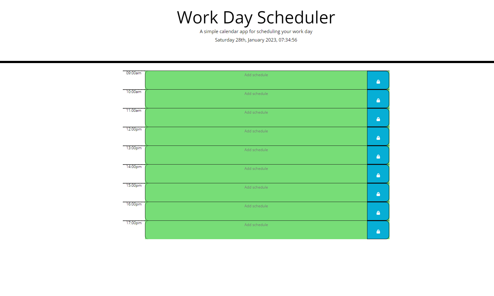

# Planner-App

# Description

This weeks challenge was to create a simple calendar application, qhich would allow users to save events for each hour of the day.  the App should run in the browser and feature dynamically updated HTML and CSS powered by jQuery.

# Usage
User should be able to view the browser with local date and time displayed.  
User should then be able to log in their schedule in the present and future times, as past should be greyed out.  Once the user clicks the padlock, their schedule should be saved to the local storage and they shoukld be able to come back to it.

# Link
https://king-mo100.github.io/Planner-App/

