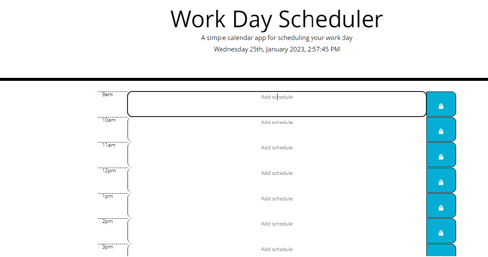

# Planner-App

# Description

This weeks challenge was to create a simple calendar application, qhich would allow users to save events for each hour of the day.  the App should run in the browser and feature dynamically updated HTML and CSS powered by jQuery.

# Usage

# Link
https://king-mo100.github.io/Planner-App/

